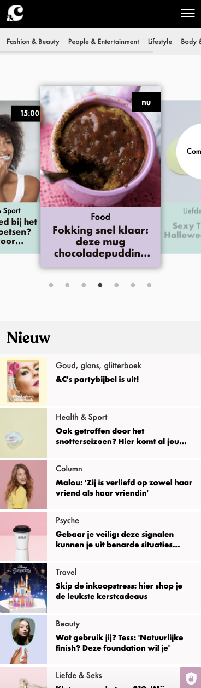
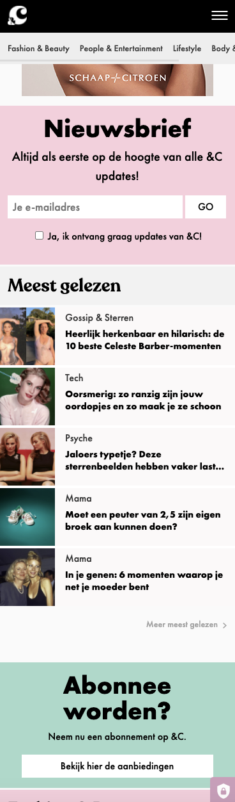
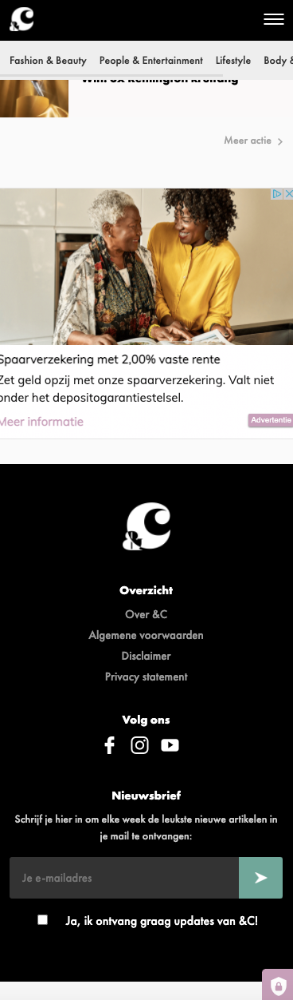
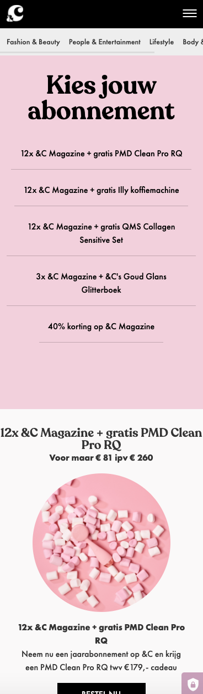
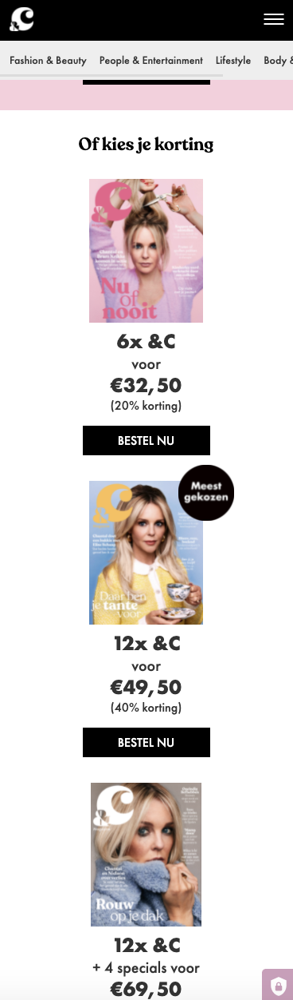
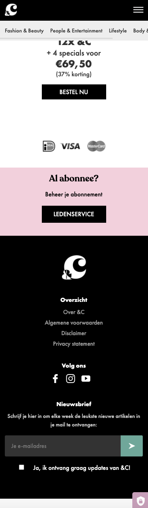

# Procesverslag
Markdown is een simpele manier om HTML te schrijven.  
Markdown cheat cheet: [Hulp bij het schrijven van Markdown](https://github.com/adam-p/markdown-here/wiki/Markdown-Cheatsheet).

Nb. De standaardstructuur en de spartaanse opmaak van de README.md zijn helemaal prima. Het gaat om de inhoud van je procesverslag. Besteedt de tijd voor pracht en praal aan je website.

Nb. Door *open* toe te voegen aan een *details* element kun je deze standaard open zetten. Fijn om dat steeds voor de relevante stuk(ken) te doen.

## Jij

uitwerken voor kick-off werkgroep

### Auteur:
Fleur van der Meer

#### Je startniveau:
Blauw

#### Je focus:
Responsive
 

## Je website

uitwerken voor kick-off werkgroep

### Je opdracht:
https://www.andc.tv

#### Screenshot(s) van de eerste pagina (small screen): 
Ik ga de homepage maken:

#### Screenshot(s) van de tweede pagina (small screen):
Ik ga de abonneren pagina maken: 

 

## Breakdownschets (week 1)

Onderstaand kun je mijn breakdown schets van week 1 vinden

### de hele pagina: 
Breakdown van de hele pagina:

### dynamisch deel (bijv menu): 
Breakdown van het hamburger menu:

## Voortgang 1 (week 2)

De eerste voorging ging opzich goed. Ik had vooral vragen over mijn hamburger menu, omdat hier aan de linkerkant ook de socials stonden en ik dit niet voor elkaar kon krijgen. Nu ik dit typ zie ik dat de socials uit het menu zijn verwijderd. Samen met Danny hebben wij het hamburger menu gemaakt, omdat wij de socials erin wilde krijgen. 

### Stand van zaken
Opzich ging het hier al best wel aardig. Ik liep zelf vast met een aantal dingen, zoals selectoren. Ik snapte niet waar de fout lag en waarom mijn selectoren niet wilde werken, zoals ik deze had toegewezen. Na veel proberen kwam ik erachter dat ik de verkeerde selector gebruikte en het daarom niet werkte. Ondertussen had ik overal al classes voor gebruikt, omdat ik verder wilde werken, dus ik kon alles weer gaan veranderen helaas. Gelukkig is het uiteindelijk goed gekomen, want mede door alle verschillende classes raakte ik in de war. 

## Voortgang 2 (week 3)

Tijdens de tweede voortgang werkte de animatie voor mijn hamburger menu niet. Uiteindelijk hebben wij besloten dat ik zelf verder moest gaan kijken. Helaas ben ik daar niet uit gekomen, maar is de rest van de website wel gelukt. 

### Stand van zaken
Om eerlijk te zijn verliep het een beetje stroef. Elke keer als ik dacht dat ik het goed aan het doen was veranderde er weer iets op mijn andere pagina. Ik wilde geen tot zo min mogelijk classes gebruiken, dus soms raakte ik een beetje in de war en was ik weer iets heel kleins vergeten. Op een gegeven moment gaf ik mijn header, main en footer van de tweede pagina een class en ging het stukken beter.

## Eindgesprek (week 5)

Uitwerken voor eindgesprek

### Stand van zaken
Hier dit ging goed & dit was lastig (neem ook screenshots op van delen van je website en code)

### Screenshot(s)

hier screenshot(s) van je eindresultaat

## Bronnenlijst

continu bijhouden terwijl je werkt

Nb. Wees specifiek ('css-tricks' als bron is bijv. niet specifiek genoeg).

1. Hamburger menu deels van Danny.
2. Alle foto afbeeldingen komen van https://www.andc.tv
3. De iconen zijn door mij gemaakt.

<!-------------------------------------->
### Aantekeningen States

States toevoegen

Beoordeling: op zijn minst hover en focus gebruiken

Hover voor muis
Focus voor tab

Bestaande states:
Visited (voor een link)
Focus na tab
Active (na link klikken als het traag is. Werkt goed op mobiel.)